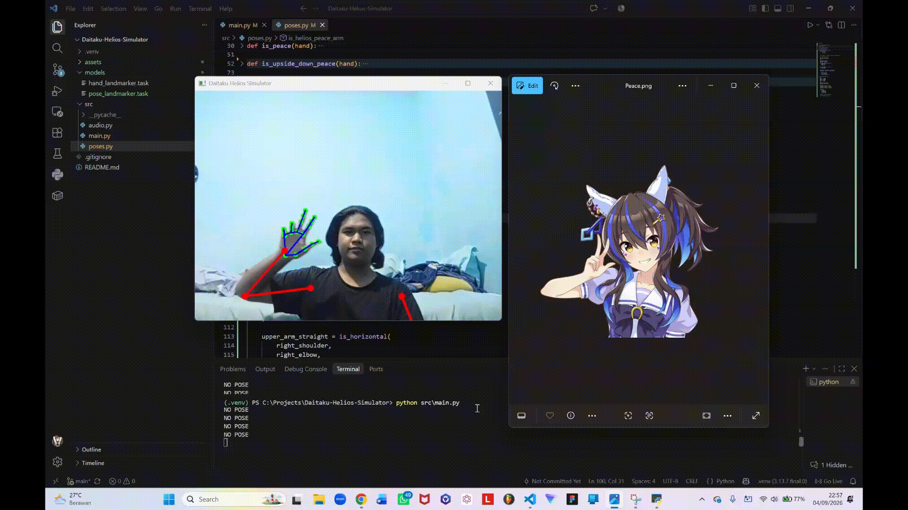
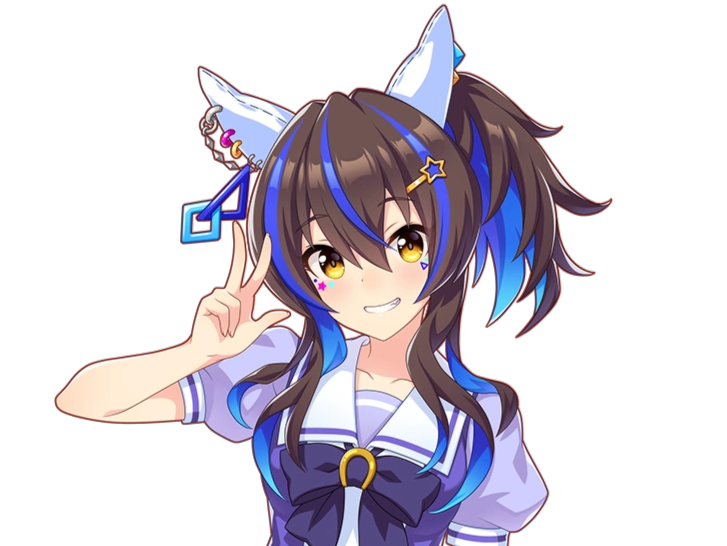

<p align="center">

  

</p>

# Daitaku Helios Simulator

Game latihan pose tangan berbasis webcam yang terinspirasi dari Daitaku Helios.

Pemain ditampilkan gambar pose tangan Helios, kemudian harus menirukan pose tersebut di depan webcam. Program mendeteksi bentuk tangan serta posisi upper body pemain menggunakan MediaPipe Hand Landmarker dan Pose Landmarker, lalu menentukan apakah pose pemain sesuai dengan pose yang diminta.

Proyek tugas mata kuliah Pengolahan Citra dan Video (PCV).

## Demo

<p align="left">

  

</p>

## Konten

* `src/main.py` — aplikasi utama: webcam, MediaPipe, dan perpindahan game state.
* `src/states.py` — definisi state permainan.
* `src/menu.py` — tampilan menu utama.
* `src/game.py` — logika gameplay, pose yang diminta, pose yang terdeteksi, dan game rendering.
* `src/poses.py` — logika deteksi berbagai pose.
* `src/audio.py` — pemutaran efek suara.
* `models/hand_landmarker.task` — model hand tracking dari MediaPipe.
* `models/pose_landmarker.task` — model pose tracking dari MediaPipe.
* `assets/img/` — gambar referensi pose Daitaku Helios dan aset visual lainnya.
* `assets/audio/` — efek suara dan audio game.
* `demo/` — video demo project.

## Test

Aktifkan virtual environment:

```powershell
.\.venv\Scripts\Activate.ps1
```

Jalankan program:

```powershell
python src/main.py
```

Aplikasi akan membuka webcam dan menjalankan game.

Pada menu utama, tekan `z` untuk memulai permainan.

Tekan `q` pada window untuk keluar.

## Teknologi

| Nama         | Fungsi                                   |
| ------------ | ---------------------------------------- |
| Python 3.13  | Bahasa pemrograman                       |
| OpenCV       | Webcam, pemrosesan gambar, dan rendering |
| MediaPipe    | Hand & upper-body pose tracking          |
| Pygame       | Pemutaran audio                          |
| Git / GitHub | Version control                          |

## Struktur Game

Game menggunakan sistem state untuk memisahkan menu dan gameplay.

State yang tersedia saat ini:

```text
MENU
  ↓
PLAYING
```

`main.py` bertugas mengatur state aktif, sedangkan masing-masing state memiliki tanggung jawabnya sendiri.

Alur utama program:

```text
main.py
   │
   ├── MENU
   │     └── menu.py
   │
   └── PLAYING
         └── game.py
                │
                ├── poses.py
                │
                └── Pose Matching
```

## Cara Kerja

Pipeline utama program:

```text
Webcam
   ↓
OpenCV
   ↓
MediaPipe Hand Landmarker
   ↓
21 Hand Landmarks
   ↓
MediaPipe Pose Landmarker
   ↓
33 Pose Landmarks
   ↓
Pose Detection
   ↓
Detected Pose
   ↓
Pose Matching
   ↓
Game Response
```

MediaPipe Hand Landmarker mendeteksi hingga dua tangan dan menghasilkan 21 landmark untuk masing-masing tangan.

MediaPipe Pose Landmarker mendeteksi 33 landmark tubuh. Pada project ini, landmark yang digunakan untuk pengenalan pose hanya bagian upper body, yaitu:

* Left shoulder
* Right shoulder
* Left elbow
* Right elbow
* Left wrist
* Right wrist

Landmark tangan digunakan untuk mengenali bentuk jari, seperti posisi jari terbuka atau terlipat.

Landmark shoulder, elbow, dan wrist digunakan untuk mengenali posisi serta bentuk gerakan lengan.

Hasil deteksi kemudian dikembalikan sebagai nama pose, misalnya:

```text
"helios_peace"
"gyaru_peace"
```

`game.py` kemudian membandingkan pose yang terdeteksi dengan pose yang sedang diminta oleh game.

```text
poses.py
    ↓
detected_pose
    ↓
game.py
    ↓
expected_pose == detected_pose
```

## Pose yang Sudah Didukung

### Peace

Pose peace biasa dengan:

* Index finger terbuka
* Middle finger terbuka
* Ring finger terlipat
* Pinky terlipat

### Gyaru Peace

Pose khas Daitaku Helios dengan dua tangan membentuk peace terbalik.

* Dua tangan harus terdeteksi
* Kedua tangan harus membentuk upside-down peace
* Jika kondisi terpenuhi, pose dianggap terdeteksi

### Helios Peace

Pose peace khas Daitaku Helios menggunakan tangan kanan dengan tambahan posisi lengan.

<p align="left">

  

</p>

* Tangan kanan harus membentuk Helios Peace
* Thumb, index, dan middle finger terbuka
* Ring dan pinky terlipat
* Upper arm harus mengarah keluar dari shoulder
* Forearm ditekuk kembali ke arah shoulder
* Hand pose dan arm pose harus terpenuhi secara bersamaan

## Progress

### 2026-09-03

* **Hand tracking berhasil.** Menggunakan MediaPipe Hand Landmarker Tasks API untuk mendeteksi hingga dua tangan dan menampilkan landmark pada webcam.
* **Pose detection.** Membuat `poses.py` untuk mendeteksi peace biasa, upside-down peace, dan Gyaru Peace menggunakan MediaPipe hand landmarks.
* **Audio response.** Menambahkan `weiii.mp3` menggunakan Pygame sebagai respons ketika pose Gyaru Peace berhasil terdeteksi. Ditambahkan cooldown agar suara tidak dimainkan berulang kali setiap frame.
* **Project setup.** Membuat project Python, virtual environment, struktur folder awal, dan memasang OpenCV, MediaPipe, serta Pygame.

### 2026-09-04

* **Upper-body tracking.** Menggunakan landmark shoulder, elbow, dan wrist untuk tracking posisi lengan tanpa menggunakan full-body pose.
* **Handedness detection.** Menambahkan pengecekan tangan kanan menggunakan informasi handedness dari MediaPipe.
* **Arm pose detection.** Menambahkan pengecekan posisi shoulder, elbow, dan wrist untuk memastikan bentuk lengan sesuai dengan pose Helios.

### 2026-09-08

* **Game state system.** Menambahkan `GameState` untuk memisahkan menu dan gameplay.
* **Main menu.** Membuat menu awal dengan instruksi untuk memulai permainan.
* **Game rendering.** Membuat canvas game berukuran 1280×720 yang menampilkan webcam dan gambar referensi pose Helios secara berdampingan.
* **Pose matching.** Menghubungkan hasil deteksi dari `poses.py` dengan `game.py` untuk membandingkan pose pemain dengan pose yang sedang diminta.
